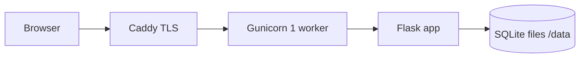

# Treasurer — architecture (concise)

## Purpose

Single Flask application for lodge treasurer workflows (members, dues, bank/cash, statements). Deployed as a **small footprint** service for a handful of concurrent users.

## Logical view

## Persistence

- **SQLite** is the only implemented database backend (`sqlite3` in `treasurer_app/db.py`).
- Schema creation and migrations are expressed with **SQLite** syntax and `sqlite_master` introspection.
- A **mirrored backup file** (`TREASURER_BACKUP_DATABASE`) is supported on the primary instance; Docker deployment sets both files under `/data`.

## Process model (production)

- **Gunicorn** runs with **one worker** and a small thread pool. Multiple worker *processes* are avoided because SQLite does not suit concurrent writers across processes.
- **PostgreSQL** is a plausible future direction but would require a dedicated porting effort (connection layer, SQL dialect, migrations, tests).

## Security notes

- **No built-in login** in the current app: treat network access (firewall, TLS, VPN, or IP allowlist) as the access-control layer until auth is added.
- **SECRET_KEY** must be set in production (Docker `.env`).

## Related docs

- `docs/Runbook.md` — local Windows operation
- `docs/Runbook-Hetzner.md` — single-server Docker deployment
- `docs/Runbook-Hosting.md` — optional Azure notes
